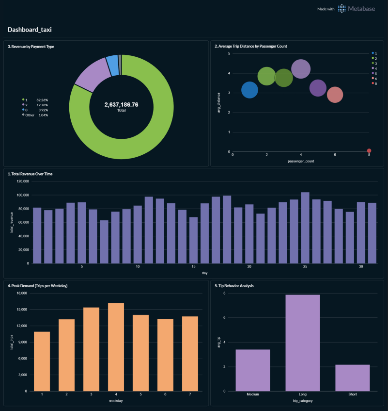

# Lab01_PART2_18135122

LABORATORIO 01-B: Ingestao de Dados End-to-End (Containerizado)

---

## Visao Geral

Este projeto implementa um pipeline completo de **Engenharia de Dados** utilizando a **Arquitetura Medallion (Bronze, Silver, Gold)**, totalmente containerizado com **Docker**.

O pipeline processa dados de corridas de taxi de Nova York (NYC Yellow Taxi) e os transforma em um modelo analitico estruturado (Star Schema) armazenado em PostgreSQL, com validacao de qualidade de dados via **Great Expectations** e visualizacao via **Metabase**.

---

## Arquitetura

### Fluxo de Dados

```
Download (NYC TLC) -> Bronze (Raw CSV) -> GX Validation -> Silver (PySpark) -> Gold (Star Schema) -> PostgreSQL -> Metabase (BI)
```

### Camadas

1. **Bronze**: Dados brutos baixados da NYC TLC, armazenados sem transformacao
2. **Validacao (Great Expectations)**: 7 expectativas aplicadas na camada Raw
3. **Silver**: Limpeza de dados, remocao de duplicatas/outliers, criacao de colunas derivadas
4. **Gold**: Modelagem Star Schema (dimensoes + fato) e carga no PostgreSQL
5. **BI (Metabase)**: Dashboard com visualizacoes conectadas ao PostgreSQL

---

## Tecnologias Utilizadas

* Python 3.11
* PySpark 4.0
* PostgreSQL 15
* Docker & Docker Compose
* Great Expectations 1.x
* Metabase (BI)
* psycopg2

---

## Estrutura do Projeto

```
Lab01_PART2_18135122/
|
|-- Data/
|   |-- raw/              # Bronze layer (CSV - git ignored)
|   |-- Silver/           # Graficos e relatorios
|
|-- gx/                   # Great Expectations (contexto e Data Docs)
|
|-- sql/
|   |-- schema.sql        # DDL do Star Schema
|   |-- queries.sql       # Consultas de negocio
|
|-- src/
|   |-- __init__.py
|   |-- config.py         # Configuracoes do banco de dados
|   |-- db.py             # Conexao PostgreSQL com retry
|   |-- spark_session.py  # Configuracao do SparkSession
|   |-- download_data.py  # Download dos dados NYC TLC
|   |-- bronze.py         # Camada Bronze
|   |-- silver.py         # Camada Silver + dimensoes + fato
|   |-- gold.py           # Carga no PostgreSQL via COPY
|   |-- validate.py       # Validacao Great Expectations
|
|-- .env                  # Variaveis de ambiente
|-- .gitignore            # Arquivos ignorados (inclui .venv)
|-- Dockerfile            # Imagem Docker do pipeline
|-- docker-compose.yml    # Orquestracao: PostgreSQL + Pipeline + Metabase
|-- pyproject.toml        # Dependencias do projeto
|-- requirements.txt      # Dependencias (pip freeze)
|-- main.py               # Ponto de entrada do pipeline
|-- README.md
```

---

## Como Reproduzir o Ambiente

### Pre-requisitos

* Docker e Docker Compose instalados
* Git

### 1. Clonar o repositorio

```bash
git clone https://github.com/MendesChris/Lab01_PART2_18135122.git
cd Lab01_PART2_18135122
```

### 2. Construir a imagem Docker

```bash
docker compose build
```

Este comando constroi a imagem do pipeline Python com:
- Python 3.11
- Java (necessario para PySpark)
- Driver JDBC do PostgreSQL
- Todas as dependencias do `requirements.txt`

### 3. Subir os containers

```bash
docker compose up -d
```

Isto inicia tres servicos:

| Servico    | Porta | Descricao                        |
|------------|-------|----------------------------------|
| postgres   | 5432  | Banco de dados PostgreSQL 15     |
| pipeline   | -     | Pipeline de ingestao Python      |
| metabase   | 3000  | Ferramenta de BI para dashboards |

### 4. Acompanhar a execucao do pipeline

```bash
docker compose logs -f pipeline
```

O pipeline executa automaticamente:
1. Download dos dados do NYC TLC (~50MB)
2. Bronze: carregamento dos dados brutos
3. Validacao Great Expectations (7 expectativas)
4. Silver: limpeza e transformacao
5. Gold: criacao do Star Schema e carga no PostgreSQL

### 5. Acessar o Metabase (Dashboard BI)

Apos o pipeline concluir, acesse:

```
http://localhost:3000
```

Configure a conexao com o PostgreSQL:
- **Host**: `postgres`
- **Port**: `5432`
- **Database**: `taxi_db`
- **Username**: `admin`
- **Password**: `admin`

### 6. Executar as validacoes do Great Expectations

As validacoes sao executadas automaticamente pelo pipeline. Para executar manualmente:

```bash
docker compose exec pipeline python -m src.validate
```

O relatorio HTML (Data Docs) e gerado em `gx/uncommitted/data_docs/`.

---

## Great Expectations - Validacao de Dados

7 expectativas sao aplicadas na camada Raw:

| # | Expectativa                              | Coluna                  | Descricao                                    |
|---|------------------------------------------|-------------------------|----------------------------------------------|
| 1 | `expect_column_values_to_not_be_null`    | tpep_pickup_datetime    | Datetime de embarque nao pode ser nulo       |
| 2 | `expect_column_values_to_not_be_null`    | tpep_dropoff_datetime   | Datetime de desembarque nao pode ser nulo    |
| 3 | `expect_column_values_to_be_between`     | trip_distance           | Distancia entre 0 e 500 milhas              |
| 4 | `expect_column_values_to_be_between`     | fare_amount             | Tarifa entre 0 e 1000 dolares               |
| 5 | `expect_column_values_to_be_between`     | passenger_count         | Passageiros entre 0 e 9                     |
| 6 | `expect_column_values_to_be_in_set`      | payment_type            | Tipo de pagamento deve ser 0-6              |
| 7 | `expect_column_values_to_not_be_null`    | total_amount            | Valor total nao pode ser nulo               |

---

## Star Schema (Gold Layer)

### Tabelas de Dimensao

**dim_date**: Dimensao temporal
| Coluna  | Tipo    | Descricao        |
|---------|---------|------------------|
| date_id | INTEGER | Chave primaria   |
| date    | DATE    | Data da corrida  |
| year    | INTEGER | Ano              |
| month   | INTEGER | Mes              |
| day     | INTEGER | Dia              |
| weekday | INTEGER | Dia da semana    |

**dim_payment**: Dimensao de pagamento
| Coluna       | Tipo    | Descricao      |
|--------------|---------|----------------|
| payment_id   | INTEGER | Chave primaria |
| payment_type | INTEGER | Tipo pagamento |

**dim_vendor**: Dimensao de fornecedor
| Coluna     | Tipo    | Descricao      |
|------------|---------|----------------|
| vendor_key | INTEGER | Chave primaria |
| VendorID   | INTEGER | ID fornecedor  |

**dim_location**: Dimensao de localizacao
| Coluna       | Tipo    | Descricao        |
|--------------|---------|------------------|
| location_id  | INTEGER | Chave primaria   |
| PULocationID | INTEGER | Local de embarque|
| DOLocationID | INTEGER | Local de desemb. |

### Tabela Fato

**fact_trips**: Fatos das corridas
| Coluna           | Tipo             | Descricao             |
|------------------|------------------|-----------------------|
| vendor_key       | INTEGER          | FK dim_vendor         |
| payment_id       | INTEGER          | FK dim_payment        |
| date_id          | INTEGER          | FK dim_date           |
| location_id      | INTEGER          | FK dim_location       |
| pickup_datetime  | TIMESTAMP        | Horario embarque      |
| dropoff_datetime | TIMESTAMP        | Horario desembarque   |
| passenger_count  | INTEGER          | Numero passageiros    |
| trip_distance    | DOUBLE PRECISION | Distancia (milhas)    |
| fare_amount      | DOUBLE PRECISION | Tarifa base           |
| tip_amount       | DOUBLE PRECISION | Gorjeta               |
| total_amount     | DOUBLE PRECISION | Valor total           |
| trip_duration_min| DOUBLE PRECISION | Duracao (minutos)     |

---

## Consultas de Negocio

5 consultas analiticas disponiveis em `sql/queries.sql`:

1. **Receita ao Longo do Tempo** - Evolucao da receita diaria
2. **Distancia Media por Passageiros** - Relacao entre passageiros e distancia
3. **Receita por Tipo de Pagamento** - Metodo de pagamento mais rentavel
4. **Demanda por Dia da Semana** - Dias de maior demanda
5. **Analise de Gorjetas** - Gorjetas por categoria de distancia

---

## Dashboard Metabase (BI)

O Metabase conecta-se ao PostgreSQL e oferece visualizacoes interativas.

**Visualizacoes sugeridas**:

1. **Grafico de Barras** - Receita total por dia da semana
2. **Grafico de Dispersao** - Distancia vs. Valor total
3. **Grafico de Linha** - Receita ao longo do tempo
4. **Grafico de Pizza** - Distribuicao por tipo de pagamento
5. **Grafico de Barras** - Gorjeta media por categoria de distancia


---

## Dicionario de Dados (Raw)

| Coluna                | Descricao                              |
|-----------------------|----------------------------------------|
| tpep_pickup_datetime  | Timestamp de inicio da corrida         |
| tpep_dropoff_datetime | Timestamp de fim da corrida            |
| passenger_count       | Numero de passageiros                  |
| trip_distance         | Distancia percorrida (milhas)          |
| fare_amount           | Tarifa base                            |
| tip_amount            | Gorjeta                                |
| total_amount          | Custo total da corrida                 |
| payment_type          | Metodo de pagamento (1=cartao, 2=cash) |
| PULocationID          | ID do local de embarque                |
| DOLocationID          | ID do local de desembarque             |
| VendorID              | ID do fornecedor                       |

---

## Autor

Christian Andrade Mendes

---

## Licenca

Este projeto e para fins academicos.
